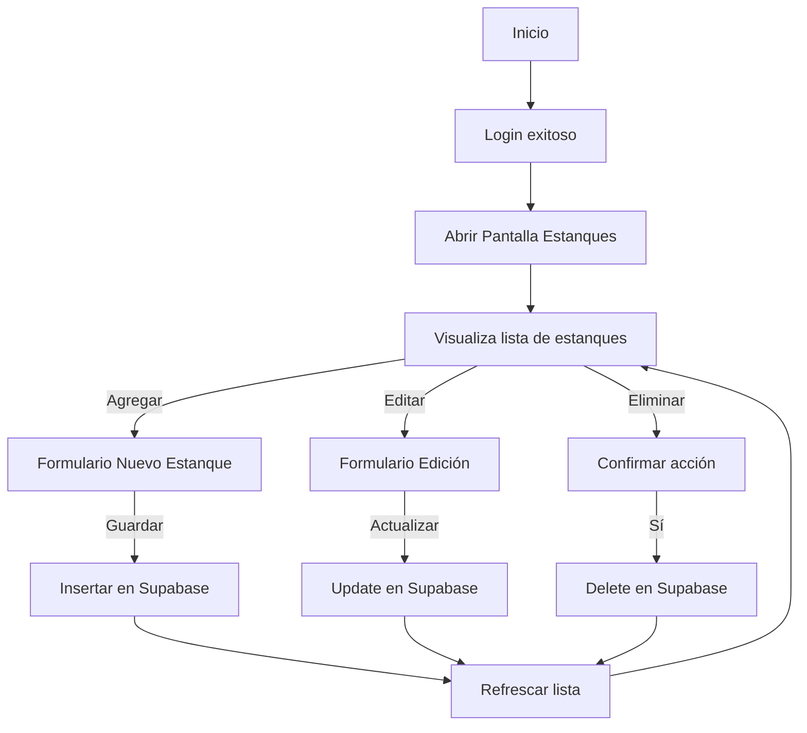

# 🐟 Plan de Implementación - Pantalla de Estanques
**Proyecto:** App de Alimentación de Peces  
**Módulo:** Gestión de Estanques  
**Backend:** Supabase  
**Frontend:** Flutter  
**Versión:** 1.0  
**Autor:** [Tu nombre aquí]  
**Fecha:** Octubre 2025  

---

## 🎯 1. Objetivo
Implementar la **pantalla de Estanques** dentro de la aplicación de Alimentación de Peces, permitiendo al usuario **registrar, visualizar, editar y eliminar** estanques asociados a la producción acuícola.

Esta pantalla servirá como base relacional para los demás módulos (Siembra, Biometría, Alimentación), mediante una **llave foránea `id_estanque`**.

---

## 🧩 2. Funcionalidades Principales

| Código | Funcionalidad | Descripción |
|---------|----------------|--------------|
| FE-01 | Ver lista de estanques | Mostrar todos los estanques almacenados en Supabase. |
| FE-02 | Crear estanque | Permitir agregar un nuevo estanque con su capacidad y número. |
| FE-03 | Editar estanque | Modificar los datos de un estanque existente. |
| FE-04 | Eliminar estanque | Borrar un estanque de la base de datos. |
| FE-05 | Validaciones | Evitar duplicados y validar campos antes de enviar datos. |
| FE-06 | Sincronización | Conectarse con Supabase para operaciones CRUD en tiempo real. |

---

## 🧠 3. Estructura de la Base de Datos (Supabase)

**Tabla:** `estanques`

| Campo | Tipo de dato | Descripción | Restricciones |
|--------|---------------|--------------|----------------|
| id | `uuid` | Identificador único del estanque | `PRIMARY KEY` |
| numero_estanque | `text` | Código o número del estanque | `UNIQUE`, `NOT NULL` |
| capacidad | `numeric` | Capacidad en litros o número de peces | `NOT NULL` |
| created_at | `timestamp` | Fecha de creación del registro | `DEFAULT now()` |
| updated_at | `timestamp` | Última modificación | `DEFAULT now()` |

### 🔐 Políticas de Seguridad (RLS)
Activar Row Level Security (RLS) en la tabla y añadir las siguientes políticas:

- **Lectura:**  
  `USERS` autenticados pueden `SELECT` todos los registros.
- **Inserción / Edición / Eliminación:**  
  Solo el usuario autenticado (`auth.uid() = owner_id`) podrá modificar sus registros.

---

## ⚙️ 4. Endpoints Supabase (Flutter SDK)

Utilizando el paquete oficial [`supabase_flutter`](https://pub.dev/packages/supabase_flutter):

### 🔹 Obtener todos los estanques
```dart
final response = await supabase.from('estanques').select();
```

### 🔹 Crear nuevo estanque
```dart
final response = await supabase.from('estanques').insert({
  'numero_estanque': numeroController.text,
  'capacidad': double.parse(capacidadController.text),
});
```

### 🔹 Actualizar estanque
```dart
final response = await supabase.from('estanques').update({
  'numero_estanque': nuevoNumero,
  'capacidad': nuevaCapacidad,
  'updated_at': DateTime.now().toIso8601String(),
}).eq('id', estanqueId);
```

### 🔹 Eliminar estanque
```dart
final response = await supabase.from('estanques').delete().eq('id', estanqueId);
```

---

## 🖥️ 5. Diseño de Interfaz (UI/UX)

### 🧱 Estructura visual
- **AppBar:** título “Estanques”.
- **Lista principal:** tarjetas con información básica del estanque (número y capacidad).
- **Botón flotante (+):** abrir modal para agregar nuevo estanque.
- **Acciones en cada tarjeta:**  
  - ✏️ Editar  
  - 🗑️ Eliminar  
- **Validaciones visuales:** mensajes de éxito o error con `SnackBar`.

### 🎨 Paleta de colores
| Elemento | Color |
|-----------|--------|
| Fondo principal | `#F4F6F8` |
| Botón principal | `#0077B6` |
| Texto primario | `#000000` |
| Texto secundario | `#555555` |
| Iconos | Azul marino / Blanco |

---

## 🔁 6. Flujo de Usuario



---

## 🧪 7. Pruebas Funcionales

| Caso de prueba | Acción | Resultado esperado |
|----------------|--------|--------------------|
| CP-01 | Crear estanque válido | Se inserta el registro y aparece en la lista |
| CP-02 | Crear estanque sin datos | Muestra mensaje de error |
| CP-03 | Editar estanque existente | Actualiza datos correctamente |
| CP-04 | Eliminar estanque | El registro desaparece y confirma acción |
| CP-05 | Cargar lista | Muestra todos los estanques desde Supabase |

---

## 🚀 8. Entregables

- Código fuente de la pantalla (`estanques_page.dart`)  
- Archivo de servicio Supabase (`supabase_service.dart`)  
- Archivo de modelo (`estanque_model.dart`)  
- Scripts SQL de creación de tabla y políticas RLS  
- Pruebas funcionales y documentación técnica  

---

## 🧾 9. Cronograma de Implementación

| Etapa | Actividad | Duración | Responsable |
|--------|------------|-----------|--------------|
| 1 | Diseño de interfaz y flujo | 1 día | Equipo UI/UX |
| 2 | Creación de tabla y políticas RLS en Supabase | 1 día | Backend |
| 3 | Programación de CRUD en Flutter | 2 días | Frontend |
| 4 | Pruebas y correcciones | 1 día | QA |
| 5 | Integración con otros módulos (Siembra) | 1 día | Integrador |

**Duración total:** 6 días hábiles.  

---

## 🧩 10. Futuras mejoras
- Implementar búsqueda y filtros de estanques.  
- Agregar campo de ubicación o tipo de estanque.  
- Integrar notificaciones sobre capacidad máxima o mantenimiento.  
- Sincronización offline con caché local (usando `hive` o `drift`).  

---

© 2025 - Proyecto App de Alimentación de Peces | Plan de Implementación de Pantalla de Estanques
