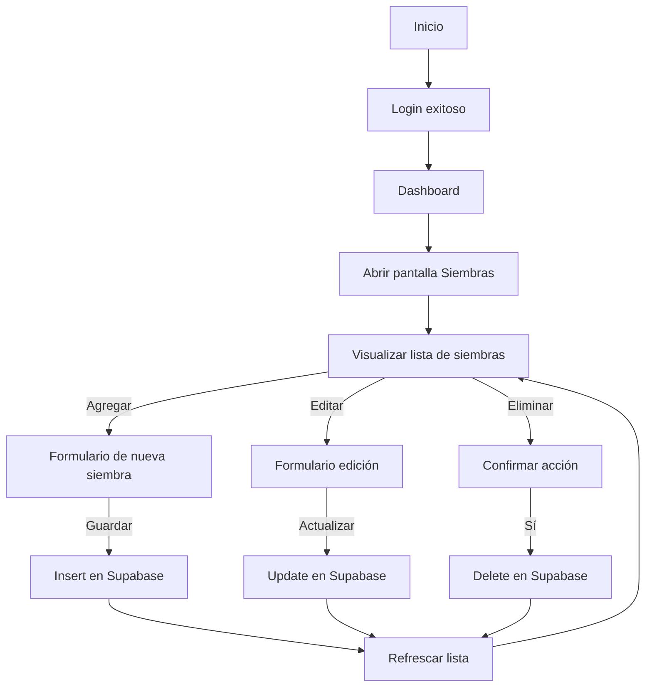

# 🌱 Plan de Implementación - Pantalla de Siembra
**Proyecto:** App de Alimentación de Peces  
**Módulo:** Gestión de Siembras  
**Backend:** Supabase  
**Frontend:** Flutter  
**Versión:** 1.0  
**Autor:** [Tu nombre aquí]  
**Fecha:** Octubre 2025  

---

## 🎯 1. Objetivo
Implementar la **pantalla de Siembra** dentro de la aplicación de Alimentación de Peces, permitiendo registrar, visualizar, editar y eliminar las siembras realizadas en cada estanque.  
Cada registro de siembra estará asociado a un **estanque** mediante una **llave foránea (`id_estanque`)**.

---

## 🧩 2. Funcionalidades Principales

| Código | Funcionalidad | Descripción |
|---------|----------------|--------------|
| FS-01 | Ver lista de siembras | Mostrar todas las siembras registradas en la base de datos. |
| FS-02 | Crear siembra | Permitir registrar una nueva siembra con especie, fecha, cantidad y muertes. |
| FS-03 | Editar siembra | Modificar los datos de una siembra existente. |
| FS-04 | Eliminar siembra | Borrar una siembra de la base de datos. |
| FS-05 | Filtrar por estanque | Mostrar siembras según el estanque seleccionado. |
| FS-06 | Validaciones | Verificar datos válidos antes de guardar (ej. cantidad > 0). |
| FS-07 | Sincronización | Sincronización en tiempo real con Supabase. |

---

## 🧠 3. Estructura de la Base de Datos (Supabase)

**Tabla:** `siembras`

| Campo | Tipo de dato | Descripción | Restricciones |
|--------|---------------|--------------|----------------|
| id | `uuid` | Identificador único | `PRIMARY KEY` |
| especie | `text` | Nombre de la especie sembrada | `NOT NULL` |
| fecha_siembra | `date` | Fecha de siembra | `NOT NULL` |
| cantidad | `integer` | Número de peces sembrados | `NOT NULL` |
| muertes | `integer` | Número de peces muertos (inicial) | `DEFAULT 0` |
| id_estanque | `uuid` | Relación con tabla estanques | `FOREIGN KEY` |
| created_at | `timestamp` | Fecha de creación | `DEFAULT now()` |
| updated_at | `timestamp` | Última modificación | `DEFAULT now()` |

### 🔐 Políticas de Seguridad (RLS)
Activar **Row Level Security** y crear las siguientes políticas:

- **SELECT:** Todos los usuarios autenticados pueden leer sus registros.  
- **INSERT / UPDATE / DELETE:** Solo el usuario autenticado (`auth.uid() = owner_id`) puede modificar sus siembras.  

---

## ⚙️ 4. Endpoints Supabase (Flutter SDK)

Usando el paquete [`supabase_flutter`](https://pub.dev/packages/supabase_flutter):

### 🔹 Obtener siembras
```dart
final response = await supabase.from('siembras').select().order('fecha_siembra', ascending: false);
```

### 🔹 Crear nueva siembra
```dart
final response = await supabase.from('siembras').insert({
  'especie': especieController.text,
  'fecha_siembra': fechaSeleccionada.toIso8601String(),
  'cantidad': int.parse(cantidadController.text),
  'muertes': int.parse(muertesController.text),
  'id_estanque': estanqueSeleccionado.id,
});
```

### 🔹 Actualizar siembra
```dart
final response = await supabase.from('siembras').update({
  'especie': nuevaEspecie,
  'cantidad': nuevaCantidad,
  'muertes': nuevasMuertes,
  'updated_at': DateTime.now().toIso8601String(),
}).eq('id', siembraId);
```

### 🔹 Eliminar siembra
```dart
final response = await supabase.from('siembras').delete().eq('id', siembraId);
```

---

## 🖥️ 5. Diseño de Interfaz (UI/UX)

### 🧱 Estructura visual
- **AppBar:** título “Siembras”.
- **Lista principal:** tarjetas mostrando especie, fecha, cantidad y estanque.
- **Botón flotante (+):** abrir formulario para nueva siembra.
- **Formulario:** campos para especie, fecha, cantidad, muertes y selector de estanque.
- **Acciones en tarjetas:** editar y eliminar.  
- **Validaciones:** mostrar errores si campos están vacíos.

### 🎨 Paleta de colores
| Elemento | Color |
|-----------|--------|
| Fondo principal | `#F4F6F8` |
| Botón principal | `#00A896` |
| Texto primario | `#000000` |
| Texto secundario | `#555555` |
| Iconos | Verde oscuro / Blanco |

---

## 🔁 6. Flujo de Usuario



---

## 🧪 7. Pruebas Funcionales

| Caso de prueba | Acción | Resultado esperado |
|----------------|--------|--------------------|
| CP-01 | Crear siembra válida | Se inserta correctamente y aparece en la lista |
| CP-02 | Campos vacíos | Muestra mensaje de error |
| CP-03 | Editar siembra existente | Actualiza y refleja cambios |
| CP-04 | Eliminar siembra | Se borra y confirma la acción |
| CP-05 | Filtrar por estanque | Muestra solo siembras asociadas |

---

## 🚀 8. Entregables

- Código fuente (`siembra_page.dart`)  
- Modelo de datos (`siembra_model.dart`)  
- Servicio Supabase (`supabase_service.dart`)  
- Scripts SQL (creación de tabla y políticas RLS)  
- Pruebas funcionales documentadas  

---

## 🧾 9. Cronograma de Implementación

| Etapa | Actividad | Duración | Responsable |
|--------|------------|-----------|--------------|
| 1 | Diseño de interfaz | 1 día | UI/UX |
| 2 | Creación de tabla y políticas en Supabase | 1 día | Backend |
| 3 | Programación CRUD Flutter | 2 días | Frontend |
| 4 | Pruebas funcionales | 1 día | QA |
| 5 | Integración con Estanques | 1 día | Integrador |

**Duración total:** 6 días hábiles.  

---

## 🧩 10. Futuras mejoras
- Agregar campo “observaciones”.  
- Mostrar alertas por mortalidad alta.  
- Relacionar automáticamente con datos de biometría.  
- Exportar datos a Excel o PDF.  

---

© 2025 - Proyecto App de Alimentación de Peces | Plan de Implementación de Pantalla de Siembras
